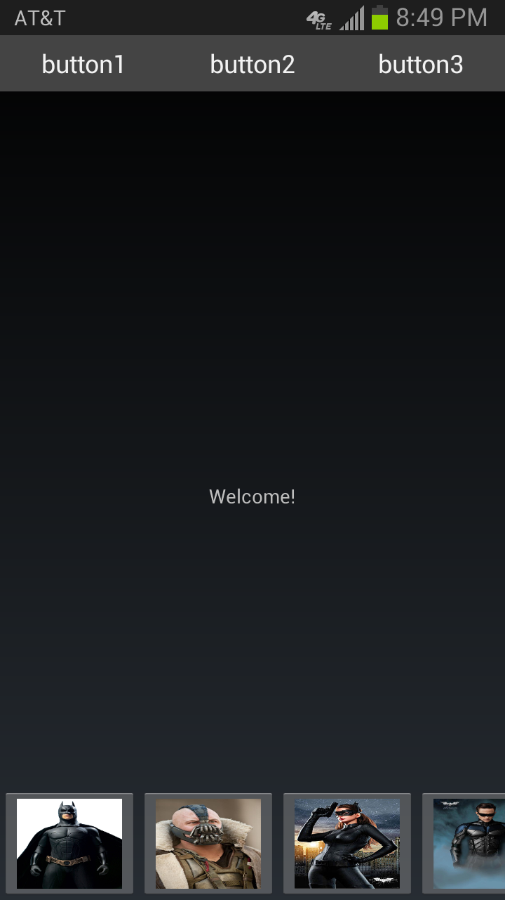
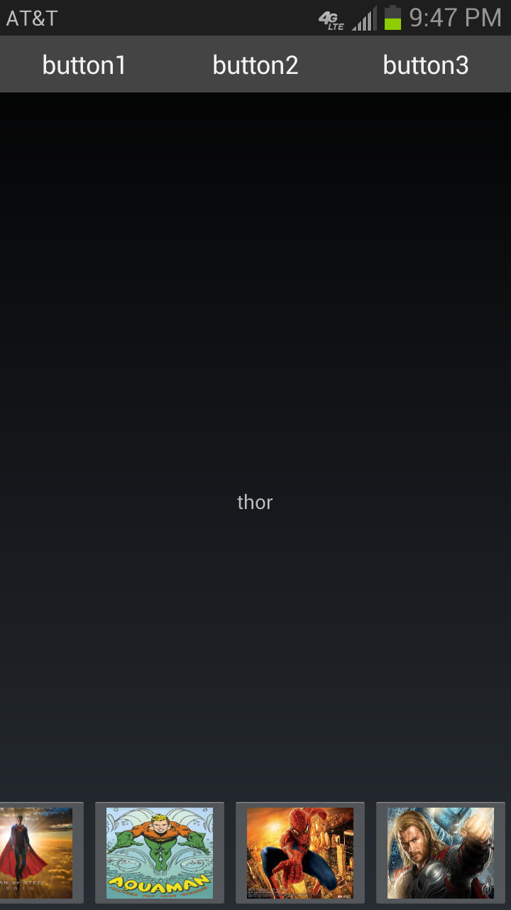

Application Android Template
=

Introduction
-

This project contains a template for an Android application. It utilizes the Holo theme and includes a custom title bar with borderless buttons and a scrollable bottom menu. To demonstrate the usage of the buttons, each button is clickable and triggers the display of a string. 

Screenshots
-

 

